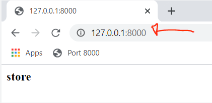

In this section we will take care of getting our project set up. We'll first install Django and handle basic configuration before we move on to part 2 where we will set up our templates.

## Install Django
```html
pip install Django
```

## Start Project
```html
django-admin startproject ecommerce
cd ecommerce
```
## Create app
```html
python manage.py startapp store
```
## Add app to settings.py
```commandline
INSTALLED_APPS = [
    'django.contrib.admin',
    'django.contrib.auth',
    'django.contrib.contenttypes',
    'django.contrib.sessions',
    'django.contrib.messages',
    'django.contrib.staticfiles',
    'store',
]

```

## Server launch
```commandline
python manage.py runnserver 8080
```
# Templates
## Create Templates Folder
```commandline
create a folder templates
```


## Create Templates


```commandline
       ///File:store.html 
       <h3>store</h3>

       ///File:cart.html
       <h3>Cart</h3>

       ///File:checkout.html
       <h3>checkout</h3>
```

# Views & URLs

## Create Views
```commandline
from django.shortcuts import render

def store(request):
	context = {}
	return render(request, 'store/store.html', context)

def cart(request):
	context = {}
	return render(request, 'store/cart.html', context)

def checkout(request):
	context = {}
	return render(request, 'store/checkout.html', context)
```
## Base URLs Configuration

```commandline
from django.contrib import admin
from django.urls import path
from store.views import * 

urlpatterns = [
    path('admin/', admin.site.urls),
    path('',store,name="store"),
    path('cart/',cart,name="cart"),
    path('checkout/',checkout,name="checkout"),
]
```

# Summary:

Now that we have our templates, views and urls configured we should be able to start our server and view our pages on port 8000.

///Command Prompt
```commandline
python manage.py runserver
```


# Static Files
In your root directory create a folder called "static".

Inside the new “static” folder, let's create a folder called "CSS" and another called "Images". These files will hold all of our CSS and Images.


## CSS File
```commandline
body{
    background-color:blue;
}
```

## STATICFILES_DIRES

///File: settings.py

```commandline
STATICFILES_DIRS = [
    os.path.join(BASE_DIR, 'static')
]
```
Add Static Files to Page
store/templates/store/store.html
```commandline

<link rel="stylesheet" type="text/css" href="">

<h3>store</h3>
```
##  Add Image
```html

<link rel="stylesheet" type="text/css" href="">

<h3>store</h3>


```

# Main Template
///File: store/templates/store/main.html
```html
<!DOCTYPE html>
<html>
    <head>
           <title>Ecom</title>
     </head>
     <body>

     </body>
</html>
```
add below:

///File: store/templates/store/main.html
```html
<!DOCTYPE html>

<html>
    <head>
           <title>Ecom</title>

        <meta name="viewport" content="width=device-width, initial-scale=1, maximum-scale=1, minimum-scale=1" />

        <link rel="stylesheet" type="text/css" href="">
     </head>
     <body>

     </body>
</html>
```
https://getbootstrap.com/

## Invoke css: ///File: store/templates/store/main.html
```html

<!DOCTYPE html>

<html>
<head>
	<title>Ecom</title>

	<meta name="viewport" content="width=device-width, initial-scale=1, maximum-scale=1, minimum-scale=1" />

	<link rel="stylesheet" href="https://stackpath.bootstrapcdn.com/bootstrap/4.4.1/css/bootstrap.min.css" integrity="sha384-Vkoo8x4CGsO3+Hhxv8T/Q5PaXtkKtu6ug5TOeNV6gBiFeWPGFN9MuhOf23Q9Ifjh" crossorigin="anonymous">

	<link rel="stylesheet" type="text/css" href="">

</head>
<body>


	<script src="https://code.jquery.com/jquery-3.4.1.slim.min.js" integrity="sha384-J6qa4849blE2+poT4WnyKhv5vZF5SrPo0iEjwBvKU7imGFAV0wwj1yYfoRSJoZ+n" crossorigin="anonymous"></script>

	<script src="https://cdn.jsdelivr.net/npm/popper.js@1.16.0/dist/umd/popper.min.js" integrity="sha384-Q6E9RHvbIyZFJoft+2mJbHaEWldlvI9IOYy5n3zV9zzTtmI3UksdQRVvoxMfooAo" crossorigin="anonymous"></script>

	<script src="https://stackpath.bootstrapcdn.com/bootstrap/4.4.1/js/bootstrap.min.js" integrity="sha384-wfSDF2E50Y2D1uUdj0O3uMBJnjuUD4Ih7YwaYd1iqfktj0Uod8GCExl3Og8ifwB6" crossorigin="anonymous"></script>
</body>
</html>
```
## Container/Navbar Placeholder
///File: store/templates/store/main.html
```html
<!DOCTYPE html>

<html>
<head>
	<title>Ecom</title>

	<meta name="viewport" content="width=device-width, initial-scale=1, maximum-scale=1, minimum-scale=1" />

	<link rel="stylesheet" href="https://stackpath.bootstrapcdn.com/bootstrap/4.4.1/css/bootstrap.min.css" integrity="sha384-Vkoo8x4CGsO3+Hhxv8T/Q5PaXtkKtu6ug5TOeNV6gBiFeWPGFN9MuhOf23Q9Ifjh" crossorigin="anonymous">

	<link rel="stylesheet" type="text/css" href="">

</head>
<body>

	<h3>Navbar Placeholder</h3>
    <hr>

     <div class="container">
            <br>
            


            
         </div>


	<script src="https://code.jquery.com/jquery-3.4.1.slim.min.js" integrity="sha384-J6qa4849blE2+poT4WnyKhv5vZF5SrPo0iEjwBvKU7imGFAV0wwj1yYfoRSJoZ+n" crossorigin="anonymous"></script>

	<script src="https://cdn.jsdelivr.net/npm/popper.js@1.16.0/dist/umd/popper.min.js" integrity="sha384-Q6E9RHvbIyZFJoft+2mJbHaEWldlvI9IOYy5n3zV9zzTtmI3UksdQRVvoxMfooAo" crossorigin="anonymous"></script>

	<script src="https://stackpath.bootstrapcdn.com/bootstrap/4.4.1/js/bootstrap.min.js" integrity="sha384-wfSDF2E50Y2D1uUdj0O3uMBJnjuUD4Ih7YwaYd1iqfktj0Uod8GCExl3Og8ifwB6" crossorigin="anonymous"></script>
</body>
</html>
```

Inheriting to all the pages

```html
///File: store/templates/store/store.html




     <h3>Store</h3>


///File: store/templates/store/cart.html




     <h3>cart</h3>


///File: store/templates/store/checkout.html




     <h3>checkout</h3>

```
# Summary:
Each page should now contain the nav bar along with its name.


# Navbar
For our navbar we use something from getbootstrap.com and make some customizations to it after we get it installed. Go to the provided link and find the navbar that looks like the one below and copy the code.

You can also just use the source code I provided in the next step.


```html
///Bootstrap Navbar code

<nav class="navbar navbar-expand-lg navbar-light bg-light">
  <a class="navbar-brand" href="#">Navbar</a>
  <button class="navbar-toggler" type="button" data-toggle="collapse" data-target="#navbarSupportedContent" aria-controls="navbarSupportedContent" aria-expanded="false" aria-label="Toggle navigation">
    <span class="navbar-toggler-icon"></span>
  </button>

  <div class="collapse navbar-collapse" id="navbarSupportedContent">
    <ul class="navbar-nav mr-auto">
      <li class="nav-item active">
        <a class="nav-link" href="#">Home <span class="sr-only">(current)</span></a>
      </li>
      <li class="nav-item">
        <a class="nav-link" href="#">Link</a>
      </li>
      <li class="nav-item dropdown">
        <a class="nav-link dropdown-toggle" href="#" id="navbarDropdown" role="button" data-toggle="dropdown" aria-haspopup="true" aria-expanded="false">
          Dropdown
        </a>
        <div class="dropdown-menu" aria-labelledby="navbarDropdown">
          <a class="dropdown-item" href="#">Action</a>
          <a class="dropdown-item" href="#">Another action</a>
          <div class="dropdown-divider"></div>
          <a class="dropdown-item" href="#">Something else here</a>
        </div>
      </li>
      <li class="nav-item">
        <a class="nav-link disabled" href="#">Disabled</a>
      </li>
    </ul>
    <form class="form-inline my-2 my-lg-0">
      <input class="form-control mr-sm-2" type="search" placeholder="Search" aria-label="Search">
      <button class="btn btn-outline-success my-2 my-sm-0" type="submit">Search</button>
    </form>
  </div>
</nav>
```
complete main.html code
```html

<!DOCTYPE html>

<html>
<head>
	<title>Ecom</title>

	<meta name="viewport" content="width=device-width, initial-scale=1, maximum-scale=1, minimum-scale=1" />

	<link rel="stylesheet" href="https://stackpath.bootstrapcdn.com/bootstrap/4.4.1/css/bootstrap.min.css" integrity="sha384-Vkoo8x4CGsO3+Hhxv8T/Q5PaXtkKtu6ug5TOeNV6gBiFeWPGFN9MuhOf23Q9Ifjh" crossorigin="anonymous">

	<link rel="stylesheet" type="text/css" href="">

</head>
<body>

	<nav class="navbar navbar-expand-lg navbar-light bg-light">
	  <a class="navbar-brand" href="#">Navbar</a>
	  <button class="navbar-toggler" type="button" data-toggle="collapse" data-target="#navbarSupportedContent" aria-controls="navbarSupportedContent" aria-expanded="false" aria-label="Toggle navigation">
	    <span class="navbar-toggler-icon"></span>
	  </button>

	  <div class="collapse navbar-collapse" id="navbarSupportedContent">
	    <ul class="navbar-nav mr-auto">
	      <li class="nav-item active">
	        <a class="nav-link" href="#">Home <span class="sr-only">(current)</span></a>
	      </li>
	      <li class="nav-item">
	        <a class="nav-link" href="#">Link</a>
	      </li>
	      <li class="nav-item dropdown">
	        <a class="nav-link dropdown-toggle" href="#" id="navbarDropdown" role="button" data-toggle="dropdown" aria-haspopup="true" aria-expanded="false">
	          Dropdown
	        </a>
	        <div class="dropdown-menu" aria-labelledby="navbarDropdown">
	          <a class="dropdown-item" href="#">Action</a>
	          <a class="dropdown-item" href="#">Another action</a>
	          <div class="dropdown-divider"></div>
	          <a class="dropdown-item" href="#">Something else here</a>
	        </div>
	      </li>
	      <li class="nav-item">
	        <a class="nav-link disabled" href="#">Disabled</a>
	      </li>
	    </ul>
	    <form class="form-inline my-2 my-lg-0">
	      <input class="form-control mr-sm-2" type="search" placeholder="Search" aria-label="Search">
	      <button class="btn btn-outline-success my-2 my-sm-0" type="submit">Search</button>
	    </form>
	  </div>
	</nav>

     <div class="container">
            <br>
            


            
         </div>


	<script src="https://code.jquery.com/jquery-3.4.1.slim.min.js" integrity="sha384-J6qa4849blE2+poT4WnyKhv5vZF5SrPo0iEjwBvKU7imGFAV0wwj1yYfoRSJoZ+n" crossorigin="anonymous"></script>

	<script src="https://cdn.jsdelivr.net/npm/popper.js@1.16.0/dist/umd/popper.min.js" integrity="sha384-Q6E9RHvbIyZFJoft+2mJbHaEWldlvI9IOYy5n3zV9zzTtmI3UksdQRVvoxMfooAo" crossorigin="anonymous"></script>

	<script src="https://stackpath.bootstrapcdn.com/bootstrap/4.4.1/js/bootstrap.min.js" integrity="sha384-wfSDF2E50Y2D1uUdj0O3uMBJnjuUD4Ih7YwaYd1iqfktj0Uod8GCExl3Og8ifwB6" crossorigin="anonymous"></script>
</body>
</html>
```
## Customize Navbar


```html
We are going to customize the Bootstrap navbar we added to fit our needs. Below I will paste in the original Bootstrap code while highlighting the areas we are updating. Anything highlighted in red is what needs to be removed and green is what we are adding.

  1   - Change title from "Navbar" to "Ecom" and set the url to our home page

  2   - Remove extra links

  3   - Remove form wrapper

  4   - Create a div with the class of class="form-inline my-2 my-lg-0". This wrapper needs to hold the positioning of the original form but now hold our shopping cart link and a login button

  5   - Create login button. We will leave the link empty for now until we create the login page

  6   - Create link to cart page

  7   - Inside cart link, add shopping cart image

  8   - Add cart total in paragraph tag with the id of "cart total"

 

 1  <nav class="navbar navbar-expand-lg navbar-light bg-light">
  <a class="navbar-brand" href="">Ecom</a>
  <button class="navbar-toggler" type="button" data-toggle="collapse" data-target="#navbarSupportedContent" aria-controls="navbarSupportedContent" aria-expanded="false" aria-label="Toggle navigation">
    <span class="navbar-toggler-icon"></span>
  </button>

  <div class="collapse navbar-collapse" id="navbarSupportedContent">
    <ul class="navbar-nav mr-auto">
      <li class="nav-item active">
        <a class="nav-link" href="">Store<span class="sr-only">(current)</span></a>
      </li>

     2   <li class="nav-item">
        <a class="nav-link" href="#">Link</a>
      </li>
      <li class="nav-item dropdown">
        <a class="nav-link dropdown-toggle" href="#" id="navbarDropdown" role="button" data-toggle="dropdown" aria-haspopup="true" aria-expanded="false">
          Dropdown
        </a>
        <div class="dropdown-menu" aria-labelledby="navbarDropdown">
          <a class="dropdown-item" href="#">Action</a>
          <a class="dropdown-item" href="#">Another action</a>
          <div class="dropdown-divider"></div>
          <a class="dropdown-item" href="#">Something else here</a>
        </div>
      </li>
      <li class="nav-item">
        <a class="nav-link disabled" href="#">Disabled</a>
      </li>

    </ul>

 3  <form class="form-inline my-2 my-lg-0">
      <input class="form-control mr-sm-2" type="search" placeholder="Search" aria-label="Search">
      <button class="btn btn-outline-success my-2 my-sm-0" type="submit">Search</button>
    </form>

 4    <div class="form-inline my-2 my-lg-0">
 5       <a href="#"class="btn btn-warning">Login</a>
         
 6       <a href="">
 7         
        </a>
 8      <p id="cart-total">0</p>

    </div>
  </div>
</nav>
```
### Final main code 
```html
<!DOCTYPE html>

<html>
<head>
	<title>Ecom</title>

	<meta name="viewport" content="width=device-width, initial-scale=1, maximum-scale=1, minimum-scale=1" />

	<link rel="stylesheet" href="https://stackpath.bootstrapcdn.com/bootstrap/4.4.1/css/bootstrap.min.css" integrity="sha384-Vkoo8x4CGsO3+Hhxv8T/Q5PaXtkKtu6ug5TOeNV6gBiFeWPGFN9MuhOf23Q9Ifjh" crossorigin="anonymous">

	<link rel="stylesheet" type="text/css" href="">

</head>
<body>

	<nav class="navbar navbar-expand-lg navbar-dark bg-dark">
	  <a class="navbar-brand" href="">Ecom</a>
	  <button class="navbar-toggler" type="button" data-toggle="collapse" data-target="#navbarSupportedContent" aria-controls="navbarSupportedContent" aria-expanded="false" aria-label="Toggle navigation">
	    <span class="navbar-toggler-icon"></span>
	  </button>

	  <div class="collapse navbar-collapse" id="navbarSupportedContent">
	    <ul class="navbar-nav mr-auto">
	      <li class="nav-item active">
	        <a class="nav-link" href="">Store <span class="sr-only">(current)</span></a>
	      </li>
	 
	    </ul>
	    <div class="form-inline my-2 my-lg-0">
	     	<a href="#"class="btn btn-warning">Login</a>
	     	
	     	<a href="">
	    		
	    	</a>
	    	<p id="cart-total">0</p>

	    </div>
	  </div>
	</nav>

     <div class="container">
            <br>
            


            
         </div>


	<script src="https://code.jquery.com/jquery-3.4.1.slim.min.js" integrity="sha384-J6qa4849blE2+poT4WnyKhv5vZF5SrPo0iEjwBvKU7imGFAV0wwj1yYfoRSJoZ+n" crossorigin="anonymous"></script>

	<script src="https://cdn.jsdelivr.net/npm/popper.js@1.16.0/dist/umd/popper.min.js" integrity="sha384-Q6E9RHvbIyZFJoft+2mJbHaEWldlvI9IOYy5n3zV9zzTtmI3UksdQRVvoxMfooAo" crossorigin="anonymous"></script>

	<script src="https://stackpath.bootstrapcdn.com/bootstrap/4.4.1/js/bootstrap.min.js" integrity="sha384-wfSDF2E50Y2D1uUdj0O3uMBJnjuUD4Ih7YwaYd1iqfktj0Uod8GCExl3Og8ifwB6" crossorigin="anonymous"></script>
</body>
</html>
```

## Custom CSS
///File: static/css/main.css
```html


body{
	background-color: hsl(0, 0%, 98%);
}

h1,h2,h3,h4,h5,h6{
	color:hsl(0, 0%, 30%);
}

.box-element{
	box-shadow:hsl(0, 0%, 80%) 0 0 16px;
	background-color: #fff;
	border-radius: 4px;
	padding: 10px;
}

.thumbnail{
	width: 100%;
	height: 200px;
	-webkit-box-shadow: -1px -3px 5px -2px rgba(214,214,214,1);
    -moz-box-shadow: -1px -3px 5px -2px rgba(214,214,214,1);
    box-shadow: -1px -3px 5px -2px rgba(214,214,214,1);
}

.product{
	border-radius: 0 0 4px 4px;
}

.bg-dark{
	background-color: #4f868c!important;
}

#cart-icon{
	width:25px;
	display: inline-block;
	margin-left: 15px;
}

#cart-total{
	display: block;
	text-align: center;
	color:#fff;
	background-color: red;
	width: 20px;
	height: 25px;
	border-radius: 50%;
	font-size: 14px;
}

.col-lg-4, .col-lg-6, .col-lg-8, .col-lg-12{
	margin-top: 10px;
}

.btn{
	border-radius: 0;
}

.row-image{
	width: 100px;
}

.form-field{
	width:250px;
	display: inline-block;
	padding: 5px;
}

.cart-row{
	display: flex;
    align-items: flex-stretch;
    padding-bottom: 10px;
    margin-bottom: 10px;
    border-bottom: 1px solid #ececec;

}

.quantity{
	display: inline-block;
	font-weight: 700;
	padding-right:10px;
	

}

.chg-quantity{
	width: 12px;
	cursor: pointer;
	display: block;
	margin-top: 5px;
	transition:.1s;
}

.chg-quantity:hover{
	opacity: .6;
}


.hidden{
	display: none!important;
}
```
# Summary:
Store.html will be a fairly simple page. The entire page will consist of multiple rows and 3 columns per row that will hold product information. For the placeholder data we will create just one row and add some data.
## store.html


## cart.html


## checkout.html


```html



	<div class="row">
		<div class="col-lg-4">
			<div class="box-element product">

			</div>
		</div>

		<div class="col-lg-4">
			<div class="box-element product">
				
			</div>
		</div>

		<div class="col-lg-4">
			<div class="box-element product">

			</div>
		</div>
	</div>


```

2.  Placeholder Content
```html
///File: store/templates/store/store.html

<div class="col-lg-4">
	
	<div class="box-element product">
		<h6><strong>Product</strong></h6>
		<hr>

		<button  class="btn btn-outline-secondary add-btn">Add to Cart</button>
		<a class="btn btn-outline-success" href="#">View</a>
		<h4 style="display: inline-block; float: right"><strong>$20</strong></h4>

	</div>
</div>
```

After the change complete code look like this:
```html



	<div class="row">
		<div class="col-lg-4">
			
			<div class="box-element product">
				<h6><strong>Product</strong></h6>
				<hr>

				<button  class="btn btn-outline-secondary add-btn">Add to Cart</button>
				<a class="btn btn-outline-success" href="#">View</a>
				<h4 style="display: inline-block; float: right"><strong>$20</strong></h4>

			</div>
		</div>

		<div class="col-lg-4">
			
			<div class="box-element product">
				<h6><strong>Product</strong></h6>
				<hr>
				
				<button  class="btn btn-outline-secondary add-btn">Add to Cart</button>
				<a class="btn btn-outline-success" href="#">View</a>
				<h4 style="display: inline-block; float: right"><strong>$20</strong></h4>
				
			</div>
		</div>

		<div class="col-lg-4">
			
			<div class="box-element product">
				<h6><strong>Product</strong></h6>
				<hr>

				<button  class="btn btn-outline-secondary add-btn">Add to Cart</button>
				<a class="btn btn-outline-success" href="#">View</a>
				<h4 style="display: inline-block; float: right"><strong>$20</strong></h4>

			</div>
		</div>
	</div>


```

#  cart.html


Complete code for cart
```html



	<div class="row">
		<div class="col-lg-12">
			<div class="box-element">

				<a  class="btn btn-outline-dark" href="">&#x2190; Continue Shopping</a>

				<br>
				<br>
				<table class="table">
					<tr>
						<th><h5>Items: <strong>3</strong></h5></th>
						<th><h5>Total:<strong> $42</strong></h5></th>
						<th>
							<a  style="float:right; margin:5px;" class="btn btn-success" href="">Checkout</a>
						</th>
					</tr>
				</table>

			</div>

			<br>
			<div class="box-element">
				<div class="cart-row">
					<div style="flex:2"></div>
					<div style="flex:2"><strong>Item</strong></div>
					<div style="flex:1"><strong>Price</strong></div>
					<div style="flex:1"><strong>Quantity</strong></div>
					<div style="flex:1"><strong>Total</strong></div>
				</div>
				
				<div class="cart-row">
					<div style="flex:2"></div>
					<div style="flex:2"><p>Product 1</p></div>
					<div style="flex:1"><p>$20</p></div>
					<div style="flex:1">
						<p class="quantity">2</p>
						<div class="quantity">
							
					
							
						</div>
					</div>
					<div style="flex:1"><p>$32</p></div>
				</div>

			</div>
		</div>
	</div>

```

## Checkout.html

Complete code for checkout:
```html



     <div class="row">
		<div class="col-lg-6">
			<div class="box-element" id="form-wrapper">
				<form id="form">
					<div id="user-info">
						<div class="form-field">
							<input required class="form-control" type="text" name="name" placeholder="Name..">
						</div>
						<div class="form-field">
							<input required class="form-control" type="email" name="email" placeholder="Email..">
						</div>
					</div>
					
					<div id="shipping-info">
						<hr>
						<p>Shipping Information:</p>
						<hr>
						<div class="form-field">
							<input class="form-control" type="text" name="address" placeholder="Address..">
						</div>
						<div class="form-field">
							<input class="form-control" type="text" name="city" placeholder="City..">
						</div>
						<div class="form-field">
							<input class="form-control" type="text" name="state" placeholder="State..">
						</div>
						<div class="form-field">
							<input class="form-control" type="text" name="zipcode" placeholder="Zip code..">
						</div>
						<div class="form-field">
							<input class="form-control" type="text" name="country" placeholder="Zip code..">
						</div>
					</div>

					<hr>
					<input id="form-button" class="btn btn-success btn-block" type="submit" value="Continue">
				</form>
			</div>

			<br>
			<div class="box-element hidden" id="payment-info">
				<small>Paypal Options</small>
			</div>
			
		</div>

		<div class="col-lg-6">
			<div class="box-element">
				<a  class="btn btn-outline-dark" href="">&#x2190; Back to Cart</a>
				<hr>
				<h3>Order Summary</h3>
				<hr>
				<div class="cart-row">
					<div style="flex:2"></div>
					<div style="flex:2"><p>Product 1</p></div>
					<div style="flex:1"><p>$20.00</p></div>
					<div style="flex:1"><p>x2</p></div>
				</div>
				<h5>Items:   2</h5>
				<h5>Total:   $4</h5>
			</div>
		</div>
	</div>

```