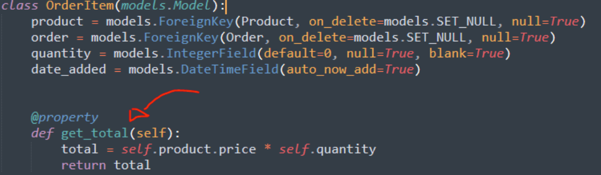

#  Data Structure
# Part 1 | Models
In this new module, part one will be about setting up our database/models. We will be working within our apps models.py, here we will create 5 models, not including the built in Django User model.


1. User- Built in Dango user model. An instance of this model will be created for each customer that registers with our website. This model will give us the ability to later use Djangos default authentication system without having to manually set this up ourselves.

2. Customer - Along with a User model each customer will contain a Customer model that holds a one to one relationship to each user. (OneToOneField). 

3. Product - The product model represents products we have in store.

4 .Order - The order model will represent a transaction that is placed or pending. The model will hold information such as the transaction ID, data completed and order status. This model will be a child or the customer model but a parent to Order Items.

5 .OrderItem- An order Item is one item with an order. So for example a shopping cart may consist of many items but is all part of one order. Therefore the OrderItem model will be a child of the PRODUCT model AND the ORDER Model.

6. ShippingAddress- Not every order will need shipping information. For orders containing physical products that need to be shipping we will need to create an instance of the shipping model to know where to send the order. Shipping will simply be a child of the order model when necessary.

Step 1 | Import User Model

```html
///File: store/models.py

from django.contrib.auth.models import User
```
Complete model code:
```python
from django.db import models
from django.contrib.auth.models import User

# Create your models here.

class Customer(models.Model):
	user = models.OneToOneField(User, null=True, blank=True, on_delete=models.CASCADE)
	name = models.CharField(max_length=200, null=True)
	email = models.CharField(max_length=200)

	def __str__(self):
		return self.name


class Product(models.Model):
	name = models.CharField(max_length=200)
	price = models.FloatField()
	digital = models.BooleanField(default=False,null=True, blank=True)

	def __str__(self):
		return self.name

class Order(models.Model):
	customer = models.ForeignKey(Customer, on_delete=models.SET_NULL, null=True, blank=True)
	date_ordered = models.DateTimeField(auto_now_add=True)
	complete = models.BooleanField(default=False)
	transaction_id = models.CharField(max_length=100, null=True)

	def __str__(self):
		return str(self.id)

class OrderItem(models.Model):
	product = models.ForeignKey(Product, on_delete=models.SET_NULL, null=True)
	order = models.ForeignKey(Order, on_delete=models.SET_NULL, null=True)
	quantity = models.IntegerField(default=0, null=True, blank=True)
	date_added = models.DateTimeField(auto_now_add=True)


class ShippingAddress(models.Model):
	customer = models.ForeignKey(Customer, on_delete=models.SET_NULL, null=True)
	order = models.ForeignKey(Order, on_delete=models.SET_NULL, null=True)
	address = models.CharField(max_length=200, null=False)
	city = models.CharField(max_length=200, null=False)
	state = models.CharField(max_length=200, null=False)
	zipcode = models.CharField(max_length=200, null=False)
	date_added = models.DateTimeField(auto_now_add=True)

	def __str__(self):
		return self.address
```

##  Migrate database
```python
python manage.py makemigrations

python manage.py migrate
```

## admin.py

```python
from django.contrib import admin

from .models import *

admin.site.register(Customer)
admin.site.register(Product)
admin.site.register(Order)
admin.site.register(OrderItem)
admin.site.register(ShippingAddress)
```
## Summary:
## Create User
Now we can create a user and login to make sure all our models were properly registered.

```
python manage.py createsuperuser
```

### Create Products
Go ahead and create a few products from the admin panel. You can copy mine if you’d like :) 


# Render Products
In views.py

```python
from django.shortcuts import render
from .models import * 

def store(request):
	products = Product.objects.all()
	context = {'products':products}
	return render(request, 'store/store.html', context)

def cart(request):
	context = {}
	return render(request, 'store/cart.html', context)

def checkout(request):
	context = {}
	return render(request, 'store/checkout.html', context)
```


1 - Loop Through Products

In store.html, let's remove 3 of the 4 columns we had and create a for loop around the one remaining column.

Just inside our row and above the column div start the for loop  and close the loop just underneath the closing tag of the column div but still inside the row 

2- Replace Fields

- Product Price

- Product Name

```



	<div class="row">
		
		<div class="col-lg-4">
			
			<div class="box-element product">
				<h6><strong>{{product.name}}</strong></h6>
				<hr>

				<button  class="btn btn-outline-secondary add-btn">Add to Cart</button>
				<a class="btn btn-outline-success" href="#">View</a>
				<h4 style="display: inline-block; float: right"><strong>${{product.price}}</strong></h4>

			</div>
		</div>
		
	</div>


```
## Summary:
Right now this is what our page should look like with the products we added to our database.


##  Product Image Field
Ok, so now it's time to add the image field to our model. 

I left this part out earlier because the image field has its own configuration we need to set up so this way we can focus on it in a single part.

Before we get started I will link up six product images for you to use if you're following my setup. Click each image individually and download them somewhere you can easily access them. DON'T add them to your static files, this will be done automatically with the imagefield when we upload them.

Download Images from internet:

# Step 1 | ImageField()

1 -Add ImageField()

In your modles.py file add “image” to your “Product” model.

model.py full code from this stage
```python
from django.db import models
from django.contrib.auth.models import User

# Create your models here.

class Customer(models.Model):
	user = models.OneToOneField(User, null=True, blank=True, on_delete=models.CASCADE)
	name = models.CharField(max_length=200, null=True)
	email = models.CharField(max_length=200)

	def __str__(self):
		return self.name


class Product(models.Model):
	name = models.CharField(max_length=200)
	price = models.FloatField()
	digital = models.BooleanField(default=False,null=True, blank=True)
	image = models.ImageField(null=True, blank=True)

	def __str__(self):
		return self.name

class Order(models.Model):
	customer = models.ForeignKey(Customer, on_delete=models.SET_NULL, null=True, blank=True)
	date_ordered = models.DateTimeField(auto_now_add=True)
	complete = models.BooleanField(default=False)
	transaction_id = models.CharField(max_length=100, null=True)

	def __str__(self):
		return str(self.id)

class OrderItem(models.Model):
	product = models.ForeignKey(Product, on_delete=models.SET_NULL, null=True)
	order = models.ForeignKey(Order, on_delete=models.SET_NULL, null=True)
	quantity = models.IntegerField(default=0, null=True, blank=True)
	date_added = models.DateTimeField(auto_now_add=True)


class ShippingAddress(models.Model):
	customer = models.ForeignKey(Customer, on_delete=models.SET_NULL, null=True)
	order = models.ForeignKey(Order, on_delete=models.SET_NULL, null=True)
	address = models.CharField(max_length=200, null=False)
	city = models.CharField(max_length=200, null=False)
	state = models.CharField(max_length=200, null=False)
	zipcode = models.CharField(max_length=200, null=False)
	date_added = models.DateTimeField(auto_now_add=True)

	def __str__(self):
		return self.address
```

2 - Run Migrations

Now you can run mirgrations to add the new field
```python
Python manage.py makemigrations

Python manage.py migrate
```        


You should now see the imagefield in your admin panel. There is still some more configuration we need to do so don't try to upload any images just yet.

And in settings.py add this below 
```python
///File: settings.py
MEDIA_URL = '/images/'
MEDIA_ROOT = os.path.join(BASE_DIR, 'static/images')
```
## Urls.py Configuration
```python
"""ecommerce URL Configuration

The `urlpatterns` list routes URLs to views. For more information please see:
    https://docs.djangoproject.com/en/3.0/topics/http/urls/
Examples:
Function views
    1. Add an import:  from my_app import views
    2. Add a URL to urlpatterns:  path('', views.home, name='home')
Class-based views
    1. Add an import:  from other_app.views import Home
    2. Add a URL to urlpatterns:  path('', Home.as_view(), name='home')
Including another URLconf
    1. Import the include() function: from django.urls import include, path
    2. Add a URL to urlpatterns:  path('blog/', include('blog.urls'))
"""
from django.contrib import admin
from django.urls import path, include
from django.conf.urls.static import static
from django.conf import settings

urlpatterns = [
    path('admin/', admin.site.urls),
    path('',store,name="store"),
    path('cart/',cart,name="cart"),
    path('checkout/',checkout,name="checkout"),
]

urlpatterns += static(settings.MEDIA_URL, document_root=settings.MEDIA_ROOT)
```

## Render Images
Now it's time to actually render these images from our models.

Traditionally we could just go to our store.html template and replace the file path in our placeholder image to our imag

```python
///File: store/store.html


      <div class="col-lg-4">
	  
		<div class="box-element product">
			<h6><strong>{{product.name}}</strong></h6>
			<hr>

			<button  class="btn btn-outline-secondary add-btn">Add to Cart</button>
			<a class="btn btn-outline-success" href="#">View</a>
			<h4 style="display: inline-block; float: right"><strong>${{product.price}}</strong></h4>

	     </div>
     </div>

```
## Image Error Solution
```python
///File: store/models.py

@property
def imageURL(self):
	try:
		url = self.image.url
	except:
		url = ''
	return url

--------------------------------------------------------------------------------

///File: store/store.html


```

# User Cart

Overview:

To close out this module let's manually add in some user data in the admin panel and render it in the cart and checkout page.

We’ll attach a customer to our user, and add some order items to go with the order which we will manually create from the admin panel.

By the end of this part our cart and checkout page will render orders/items the logged in user has in his or her cart.

# Step 1 | Add data (Admin Panel)


Step 2 | Query Data (Cart)
In order to load pages correctly we will need to create two different scenarios in our views. One for an authenticated user and one for a simple page visitor.

We want both logged in and not logged in users to be able to view the pages but also not break the page when we can't find a registered user associated with the page visitor.

Query User Cart

In our cart view we want to start by finding the logged in users account, order and cart items. 

Let's start by first checking if the user is authenticated, and then getting the customer along with finding or creating and order using the get_or_create() method.

get_or_create() https://docs.djangoproject.com/en/3.0/ref/models/querysets/#get-or-create

Once we have the customer and order/cart let's query the cart items with order.orderitem_set.all(). Make sure to add in the items in to the context dictionary so we can use them in our page.

Full code of view.py
```python
from django.shortcuts import render
from .models import * 

def store(request):
	products = Product.objects.all()
	context = {'products':products}
	return render(request, 'store/store.html', context)

def cart(request):

	if request.user.is_authenticated:
		customer = request.user.customer
		order, created = Order.objects.get_or_create(customer=customer, complete=False)
		items = order.orderitem_set.all()
	else:
		#Create empty cart for now for non-logged in user
		items = []

	context = {'items':items}
	return render(request, 'store/cart.html', context)

def checkout(request):
	context = {}
	return render(request, 'store/checkout.html', context)
```
## Step 3 | Render data (cart.html)
In the last step we queried the cart items so now let's render some data out in our template.

Let's create a for loop around our cart row (below header row) and render a row for each item in our cart. For now replace the filler data with the cart item data. We’ll leave the total alone for now.

Replace:

-ImageURL

- Product Name

- Price

- Quantity


## Step 3 | Calculating Totals


 We can fix this by adding some model methods just like we did with the product url. 

For the OrderItem model we want to derive the total price from the product price multiplied by the quantity.




full code:
```python
from django.db import models
from django.contrib.auth.models import User

# Create your models here.

class Customer(models.Model):
	user = models.OneToOneField(User, null=True, blank=True, on_delete=models.CASCADE)
	name = models.CharField(max_length=200, null=True)
	email = models.CharField(max_length=200)

	def __str__(self):
		return self.name


class Product(models.Model):
	name = models.CharField(max_length=200)
	price = models.FloatField()
	digital = models.BooleanField(default=False,null=True, blank=True)
	image = models.ImageField(null=True, blank=True)

	def __str__(self):
		return self.name

	@property
	def imageURL(self):
		try:
			url = self.image.url
		except:
			url = ''
		return url

class Order(models.Model):
	customer = models.ForeignKey(Customer, on_delete=models.SET_NULL, null=True, blank=True)
	date_ordered = models.DateTimeField(auto_now_add=True)
	complete = models.BooleanField(default=False)
	transaction_id = models.CharField(max_length=100, null=True)

	def __str__(self):
		return str(self.id)

	@property
	def get_cart_total(self):
		orderitems = self.orderitem_set.all()
		total = sum([item.get_total for item in orderitems])
		return total 

	@property
	def get_cart_items(self):
		orderitems = self.orderitem_set.all()
		total = sum([item.quantity for item in orderitems])
		return total 

class OrderItem(models.Model):
	product = models.ForeignKey(Product, on_delete=models.SET_NULL, null=True)
	order = models.ForeignKey(Order, on_delete=models.SET_NULL, null=True)
	quantity = models.IntegerField(default=0, null=True, blank=True)
	date_added = models.DateTimeField(auto_now_add=True)

	@property
	def get_total(self):
		total = self.product.price * self.quantity
		return total

class ShippingAddress(models.Model):
	customer = models.ForeignKey(Customer, on_delete=models.SET_NULL, null=True)
	order = models.ForeignKey(Order, on_delete=models.SET_NULL, null=True)
	address = models.CharField(max_length=200, null=False)
	city = models.CharField(max_length=200, null=False)
	state = models.CharField(max_length=200, null=False)
	zipcode = models.CharField(max_length=200, null=False)
	date_added = models.DateTimeField(auto_now_add=True)

	def __str__(self):
		return self.address
```
# Step 5 | Query Totals
Before we can render the cart and item totals we need to adjust our views to get this data and render it through the context dictionary.

First let's pass in the order we created OR queries into context


```python
from django.shortcuts import render
from .models import * 

def store(request):
	products = Product.objects.all()
	context = {'products':products}
	return render(request, 'store/store.html', context)

def cart(request):

	if request.user.is_authenticated:
		customer = request.user.customer
		order, created = Order.objects.get_or_create(customer=customer, complete=False)
		items = order.orderitem_set.all()
	else:
		#Create empty cart for now for non-logged in user
		items = []
		order = {'get_cart_total':0, 'get_cart_items':0}

	context = {'items':items, 'order':order}
	return render(request, 'store/cart.html', context)

def checkout(request):
	context = {}
	return render(request, 'store/checkout.html', context)
```

# Step 6 | Render Totals

///File: templates/store/cart.html
```python



	<div class="row">
		<div class="col-lg-12">
			<div class="box-element">

				<a  class="btn btn-outline-dark" href="">&#x2190; Continue Shopping</a>

				<br>
				<br>
				<table class="table">
					<tr>
						<th><h5>Items: <strong>{{order.get_cart_items}}</strong></h5></th>
						<th><h5>Total:<strong> ${{order.get_cart_total|floatformat:2}}</strong></h5></th>
						<th>
							<a  style="float:right; margin:5px;" class="btn btn-success" href="">Checkout</a>
						</th>
					</tr>
				</table>

			</div>

			<br>
			<div class="box-element">
				<div class="cart-row">
					<div style="flex:2"></div>
					<div style="flex:2"><strong>Item</strong></div>
					<div style="flex:1"><strong>Price</strong></div>
					<div style="flex:1"><strong>Quantity</strong></div>
					<div style="flex:1"><strong>Total</strong></div>
				</div>
				
				<div class="cart-row">
					<div style="flex:2"></div>
					<div style="flex:2"><p>{{item.product.name}}</p></div>
					<div style="flex:1"><p>${{item.product.price|floatformat:2}}</p></div>
					<div style="flex:1">
						<p class="quantity">{{item.quantity}}</p>
						<div class="quantity">
							
					
							
						</div>
					</div>
					<div style="flex:1"><p>${{item.get_total|floatformat:2}}</p></div>
				</div>
				
			</div>
		</div>
	</div>

```
# Step 7 | Checkout Page Data
Below changes we need to do in the checkout and views.py

checkout.html
```python
///File: store/views.py

def checkout(request):
	if request.user.is_authenticated:
		customer = request.user.customer
		order, created = Order.objects.get_or_create(customer=customer, complete=False)
		items = order.orderitem_set.all()
	else:
		#Create empty cart for now for non-logged in user
		items = []
		order = {'get_cart_total':0, 'get_cart_items':0}

	context = {'items':items, 'order':order}
	return render(request, 'store/checkout.html', context)

----------------------------------------------------------------------------------------------------------
///File: templates/store/checkout.html

<div class="box-element">
	<a  class="btn btn-outline-dark" href="">&#x2190; Back to Cart</a>
	<hr>
	<h3>Order Summary</h3>
	<hr>
	
	<div class="cart-row">
		<div style="flex:2"></div>
		<div style="flex:2"><p>{{item.product.name}}</p></div>
		<div style="flex:1"><p>${{item.product.price|floatformat:2}}</p></div>
		<div style="flex:1"><p>x{{item.quantity}}</p></div>
	</div>
	
	<h5>Items:   {{order.get_cart_items}}</h5>
	<h5>Total:   ${{order.get_cart_total|floatformat:2}}</h5>
</div>
```


```python



     <div class="row">
		<div class="col-lg-6">
			<div class="box-element" id="form-wrapper">
				<form id="form">
					<div id="user-info">
						<div class="form-field">
							<input required class="form-control" type="text" name="name" placeholder="Name..">
						</div>
						<div class="form-field">
							<input required class="form-control" type="email" name="email" placeholder="Email..">
						</div>
					</div>
					
					<div id="shipping-info">
						<hr>
						<p>Shipping Information:</p>
						<hr>
						<div class="form-field">
							<input class="form-control" type="text" name="address" placeholder="Address..">
						</div>
						<div class="form-field">
							<input class="form-control" type="text" name="city" placeholder="City..">
						</div>
						<div class="form-field">
							<input class="form-control" type="text" name="state" placeholder="State..">
						</div>
						<div class="form-field">
							<input class="form-control" type="text" name="zipcode" placeholder="Zip code..">
						</div>
						<div class="form-field">
							<input class="form-control" type="text" name="country" placeholder="Zip code..">
						</div>
					</div>

					<hr>
					<input id="form-button" class="btn btn-success btn-block" type="submit" value="Continue">
				</form>
			</div>

			<br>
			<div class="box-element hidden" id="payment-info">
				<small>Paypal Options</small>
			</div>
			
		</div>

		<div class="col-lg-6">
			<div class="box-element">
				<a  class="btn btn-outline-dark" href="">&#x2190; Back to Cart</a>
				<hr>
				<h3>Order Summary</h3>
				<hr>
				
				<div class="cart-row">
					<div style="flex:2"></div>
					<div style="flex:2"><p>{{item.product.name}}</p></div>
					<div style="flex:1"><p>${{item.product.price|floatformat:2}}</p></div>
					<div style="flex:1"><p>x{{item.quantity}}</p></div>
				</div>
				
				<h5>Items:   {{order.get_cart_items}}</h5>
				<h5>Total:   ${{order.get_cart_total|floatformat:2}}</h5>
			</div>
		</div>
	</div>

```

