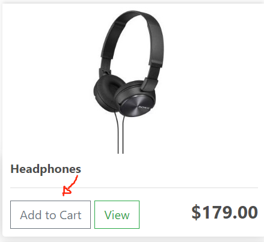
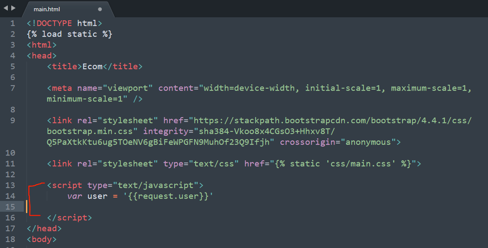
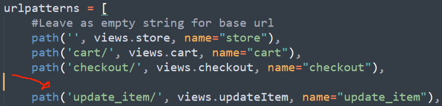
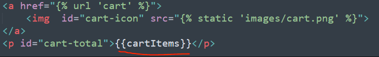
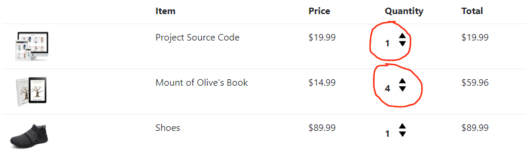
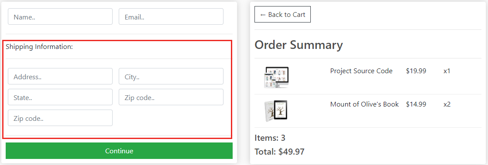
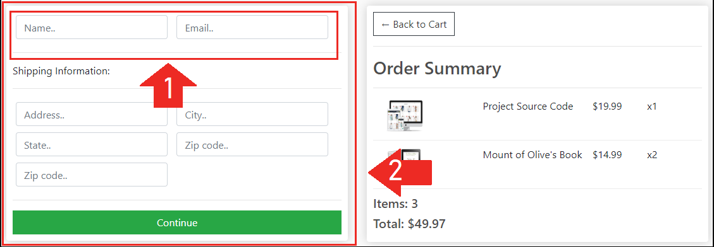

#  Site Functionality
# Part 1 | Add to Cart
Overview:

In this module we will begin to add in core user functionality such as “add to cart”, “update cart” and “checkout”.

For now we will only cover functionality for "Logged In" users and take care of "Guest Users" functionality in the next module.

Users will be able to checkout WITHOUT payment for now. This is so we can cover the core logic and integrate that in the module after we add in guest checkout capabilities on top of what we will add in this module.

Using Javascript

We will be using Javascript to handle a lot of the frontend functionality and sending data to the backend. If you're not too comfortable with Javascript I'll try to keep things as simple as possible but I definitely recommend you continue with this section after you have some base knowledge or at least give yourself time to study it along with this tutorial when something does not make sense.

## Step 1 | Cart.js
Our home page "store.html" and cart (cart.html) will both give the user the ability to add to and remove items from our cart.

Because of this, we want to write this logic in one file and simply link it to our main template so it can be available on all pages that need it instead of having to repeat our code.

Create JS folder + file

In our static folder let's create a folder inside called "js". Inside the "js" folder create a file called "cart.js".


In main.html add this 
```python
<!DOCTYPE html>

<html>
<head>
	<title>Ecom</title>

	<meta name="viewport" content="width=device-width, initial-scale=1, maximum-scale=1, minimum-scale=1" />

	<link rel="stylesheet" href="https://stackpath.bootstrapcdn.com/bootstrap/4.4.1/css/bootstrap.min.css" integrity="sha384-Vkoo8x4CGsO3+Hhxv8T/Q5PaXtkKtu6ug5TOeNV6gBiFeWPGFN9MuhOf23Q9Ifjh" crossorigin="anonymous">

	<link rel="stylesheet" type="text/css" href="">

</head>
<body>

	<nav class="navbar navbar-expand-lg navbar-dark bg-dark">
	  <a class="navbar-brand" href="">Ecom</a>
	  <button class="navbar-toggler" type="button" data-toggle="collapse" data-target="#navbarSupportedContent" aria-controls="navbarSupportedContent" aria-expanded="false" aria-label="Toggle navigation">
	    <span class="navbar-toggler-icon"></span>
	  </button>

	  <div class="collapse navbar-collapse" id="navbarSupportedContent">
	    <ul class="navbar-nav mr-auto">
	      <li class="nav-item active">
	        <a class="nav-link" href="">Store <span class="sr-only">(current)</span></a>
	      </li>
	 
	    </ul>
	    <div class="form-inline my-2 my-lg-0">
	     	<a href="#"class="btn btn-warning">Login</a>
	     	
	     	<a href="">
	    		
	    	</a>
	    	<p id="cart-total">0</p>

	    </div>
	  </div>
	</nav>

     <div class="container">
            <br>
            


            
         </div>


	<script src="https://code.jquery.com/jquery-3.4.1.slim.min.js" integrity="sha384-J6qa4849blE2+poT4WnyKhv5vZF5SrPo0iEjwBvKU7imGFAV0wwj1yYfoRSJoZ+n" crossorigin="anonymous"></script>

	<script src="https://cdn.jsdelivr.net/npm/popper.js@1.16.0/dist/umd/popper.min.js" integrity="sha384-Q6E9RHvbIyZFJoft+2mJbHaEWldlvI9IOYy5n3zV9zzTtmI3UksdQRVvoxMfooAo" crossorigin="anonymous"></script>

	<script src="https://stackpath.bootstrapcdn.com/bootstrap/4.4.1/js/bootstrap.min.js" integrity="sha384-wfSDF2E50Y2D1uUdj0O3uMBJnjuUD4Ih7YwaYd1iqfktj0Uod8GCExl3Og8ifwB6" crossorigin="anonymous"></script>

	<script type="text/javascript" src=""></script>
</body>
</html>
```

create file in js as cart.js
```html
console.log("Hello welcome to microdegree fam")
```

## Step 2 | Add Event HandlersStep

Let's add an event handler to the buttons on store.html.

Add Class to Buttons

First let's add the class of “update-cart” to the add button.

Product ID & Action

We also want to add in a custom attribute to the button so we know which product was clicked. To set a custom attribute all we need to add in data-”attribute_name=value”.

In our case we will call ours “product” so go ahead and add data-product=”{{product.id}}”. On each iteration the we will pass in the product id as the “product” attribute.

Let's also add an action attribute that lets us know that when this button is clicked we want to “add” an item. This will make more sense later when we add in the ability to remove an item or decrease quanity in the cart.

## (main.html)


///File: templates/store/main.html
```html


<script type="text/javascript">
		var user = '{{request.user}}'
</script>
```
### cart.js file

```html
var updateBtns = document.getElementsByClassName('update-cart')

for (i = 0; i < updateBtns.length; i++) {
	updateBtns[i].addEventListener('click', function(){
		var productId = this.dataset.product
		var action = this.dataset.action
		console.log('productId:', productId, 'Action:', action)

		console.log('USER:', user)
		if (user == 'AnonymousUser'){
			console.log('User is not authenticated')
			
		}else{
			console.log('User is authenticated, sending data...')
		}

	})
}
```

## Step 4 | updateItem View


## Step 5 | updateUserOrder()
```html
var updateBtns = document.getElementsByClassName('update-cart')

for (i = 0; i < updateBtns.length; i++) {
	updateBtns[i].addEventListener('click', function(){
		var productId = this.dataset.product
		var action = this.dataset.action
		console.log('productId:', productId, 'Action:', action)
		console.log('USER:', user)

		if (user == 'AnonymousUser'){
			console.log('User is not authenticated')
			
		}else{
			updateUserOrder(productId, action)
		}
	})
}

function updateUserOrder(productId, action){
	console.log('User is authenticated, sending data...')

		var url = '/update_item/'

		fetch(url, {
			method:'POST',
			headers:{
				'Content-Type':'application/json',
			}, 
			body:JSON.stringify({'productId':productId, 'action':action})
		})
		.then((response) => {
		   return response.json();
		})
		.then((data) => {
		    console.log('Data:', data)
		});
}
```

## Step 6 | CSRF Token

Right now our updateUserOrder function in cart.js will return an error because we are not sending a csrf token.

Traditionally we send a csrf token in a form by passing it in like this within the form ..

Because we are using Javascript to send data and are not actually submitting a form so we will need to create our own token and pass it in with the post data. The Django documentation gives us a work around so I’ll link up the instructions on creating our own with slight customizations.
https://docs.djangoproject.com/en/3.0/ref/csrf/#ajax

Create Token

We’ll create our token within the script tag we made earlier inside our main.html file. I copied and pasted exactly what the Django documentation tells us but I changed the name of the function from getCookie() to getToken().
````html
<!DOCTYPE html>

<html>
<head>
	<title>Ecom</title>

	<meta name="viewport" content="width=device-width, initial-scale=1, maximum-scale=1, minimum-scale=1" />

	<link rel="stylesheet" href="https://stackpath.bootstrapcdn.com/bootstrap/4.4.1/css/bootstrap.min.css" integrity="sha384-Vkoo8x4CGsO3+Hhxv8T/Q5PaXtkKtu6ug5TOeNV6gBiFeWPGFN9MuhOf23Q9Ifjh" crossorigin="anonymous">

	<link rel="stylesheet" type="text/css" href="">

	<script type="text/javascript">
		var user = '{{request.user}}'

		function getToken(name) {
		    var cookieValue = null;
		    if (document.cookie && document.cookie !== '') {
		        var cookies = document.cookie.split(';');
		        for (var i = 0; i < cookies.length; i++) {
		            var cookie = cookies[i].trim();
		            // Does this cookie string begin with the name we want?
		            if (cookie.substring(0, name.length + 1) === (name + '=')) {
		                cookieValue = decodeURIComponent(cookie.substring(name.length + 1));
		                break;
		            }
		        }
		    }
		    return cookieValue;
		}
		var csrftoken = getToken('csrftoken')
	
	</script>

</head>
<body>

	<nav class="navbar navbar-expand-lg navbar-dark bg-dark">
	  <a class="navbar-brand" href="">Ecom</a>
	  <button class="navbar-toggler" type="button" data-toggle="collapse" data-target="#navbarSupportedContent" aria-controls="navbarSupportedContent" aria-expanded="false" aria-label="Toggle navigation">
	    <span class="navbar-toggler-icon"></span>
	  </button>

	  <div class="collapse navbar-collapse" id="navbarSupportedContent">
	    <ul class="navbar-nav mr-auto">
	      <li class="nav-item active">
	        <a class="nav-link" href="">Store <span class="sr-only">(current)</span></a>
	      </li>
	 
	    </ul>
	    <div class="form-inline my-2 my-lg-0">
	     	<a href="#"class="btn btn-warning">Login</a>
	     	
	     	<a href="">
	    		
	    	</a>
	    	<p id="cart-total">0</p>

	    </div>
	  </div>
	</nav>

     <div class="container">
            <br>
            


            
         </div>


	<script src="https://code.jquery.com/jquery-3.4.1.slim.min.js" integrity="sha384-J6qa4849blE2+poT4WnyKhv5vZF5SrPo0iEjwBvKU7imGFAV0wwj1yYfoRSJoZ+n" crossorigin="anonymous"></script>

	<script src="https://cdn.jsdelivr.net/npm/popper.js@1.16.0/dist/umd/popper.min.js" integrity="sha384-Q6E9RHvbIyZFJoft+2mJbHaEWldlvI9IOYy5n3zV9zzTtmI3UksdQRVvoxMfooAo" crossorigin="anonymous"></script>

	<script src="https://stackpath.bootstrapcdn.com/bootstrap/4.4.1/js/bootstrap.min.js" integrity="sha384-wfSDF2E50Y2D1uUdj0O3uMBJnjuUD4Ih7YwaYd1iqfktj0Uod8GCExl3Og8ifwB6" crossorigin="anonymous"></script>

	<script type="text/javascript" src=""></script>
</body>
</html>
````
## Step 7 | updateItem view logic

````html
from django.shortcuts import render
from django.http import JsonResponse
import json

from .models import * 

def store(request):
	products = Product.objects.all()
	context = {'products':products}
	return render(request, 'store/store.html', context)

def cart(request):

	if request.user.is_authenticated:
		customer = request.user.customer
		order, created = Order.objects.get_or_create(customer=customer, complete=False)
		items = order.orderitem_set.all()
	else:
		#Create empty cart for now for non-logged in user
		items = []
		order = {'get_cart_total':0, 'get_cart_items':0}

	context = {'items':items, 'order':order}
	return render(request, 'store/cart.html', context)

def checkout(request):
	if request.user.is_authenticated:
		customer = request.user.customer
		order, created = Order.objects.get_or_create(customer=customer, complete=False)
		items = order.orderitem_set.all()
	else:
		#Create empty cart for now for non-logged in user
		items = []
		order = {'get_cart_total':0, 'get_cart_items':0}

	context = {'items':items, 'order':order}
	return render(request, 'store/checkout.html', context)

def updateItem(request):
	data = json.loads(request.body)
	productId = data['productId']
	action = data['action']
	print('Action:', action)
	print('Product:', productId)

	customer = request.user.customer
	product = Product.objects.get(id=productId)
	order, created = Order.objects.get_or_create(customer=customer, complete=False)

	orderItem, created = OrderItem.objects.get_or_create(order=order, product=product)

	if action == 'add':
		orderItem.quantity = (orderItem.quantity + 1)
	elif action == 'remove':
		orderItem.quantity = (orderItem.quantity - 1)

	orderItem.save()

	if orderItem.quantity <= 0:
		orderItem.delete()

	return JsonResponse('Item was added', safe=False)
````

## Step 8 | Cart Total
```html
///File: store/views.py

def store(request):

	if request.user.is_authenticated:
		customer = request.user.customer
		order, created = Order.objects.get_or_create(customer=customer, complete=False)
		items = order.orderitem_set.all()
		cartItems = order.get_cart_items
	else:
		#Create empty cart for now for non-logged in user
		items = []
		order = {'get_cart_total':0, 'get_cart_items':0}
		cartItems = order['get_cart_items']

	products = Product.objects.all()
	context = {'products':products, 'cartItems':cartItems}
	return render(request, 'store/store.html', context)
```
Add total to template

Now that we have passed in the total to all pages; let's add it to our navbar.



---
# Part 2 | Update Cart
Overview:

This section will cover changing the quantity of items in our cart and removing items once the quantity goes below zero.

We’ll be able to cover this part in a single step since most of the functionality was completed in the last module. All we need to do here is add some classes to our up/down arrows and custom attributes for the product ID and action type.


/// File: templates/store/cart.html
```
<div style="flex:1">
	<p class="quantity">{{item.quantity}}</p>
	<div class="quantity">
		

		
	</div>
</div>
```
## Part 3 | Shipping Address
Overview:

In this part we are going to work on the form in our checkout page. We need to add some logic to this page that changes what users will see depending on whether their cart contains an item that needs to be shipped.


Page Logic Explanation

If item needs shipping → Show Address Fields

We don't need to show the shipping form if none of the products are physical products. No need to ship a digital product.

Let’s start by adding a method to our "Order" model to check for items in cart that may not be digital, then using this information to change how our for and payment option gets rendered.


### Step 1 | Shipping Method

In models.py
```html
from django.db import models
from django.contrib.auth.models import User

# Create your models here.

class Customer(models.Model):
	user = models.OneToOneField(User, null=True, blank=True, on_delete=models.CASCADE)
	name = models.CharField(max_length=200, null=True)
	email = models.CharField(max_length=200)

	def __str__(self):
		return self.name


class Product(models.Model):
	name = models.CharField(max_length=200)
	price = models.FloatField()
	digital = models.BooleanField(default=False,null=True, blank=True)
	image = models.ImageField(null=True, blank=True)

	def __str__(self):
		return self.name

	@property
	def imageURL(self):
		try:
			url = self.image.url
		except:
			url = ''
		return url

class Order(models.Model):
	customer = models.ForeignKey(Customer, on_delete=models.SET_NULL, null=True, blank=True)
	date_ordered = models.DateTimeField(auto_now_add=True)
	complete = models.BooleanField(default=False)
	transaction_id = models.CharField(max_length=100, null=True)

	def __str__(self):
		return str(self.id)
		
	@property
	def shipping(self):
		shipping = False
		orderitems = self.orderitem_set.all()
		for i in orderitems:
			if i.product.digital == False:
				shipping = True
		return shipping

	@property
	def get_cart_total(self):
		orderitems = self.orderitem_set.all()
		total = sum([item.get_total for item in orderitems])
		return total 

	@property
	def get_cart_items(self):
		orderitems = self.orderitem_set.all()
		total = sum([item.quantity for item in orderitems])
		return total 

class OrderItem(models.Model):
	product = models.ForeignKey(Product, on_delete=models.SET_NULL, null=True)
	order = models.ForeignKey(Order, on_delete=models.SET_NULL, null=True)
	quantity = models.IntegerField(default=0, null=True, blank=True)
	date_added = models.DateTimeField(auto_now_add=True)

	@property
	def get_total(self):
		total = self.product.price * self.quantity
		return total

class ShippingAddress(models.Model):
	customer = models.ForeignKey(Customer, on_delete=models.SET_NULL, null=True)
	order = models.ForeignKey(Order, on_delete=models.SET_NULL, null=True)
	address = models.CharField(max_length=200, null=False)
	city = models.CharField(max_length=200, null=False)
	state = models.CharField(max_length=200, null=False)
	zipcode = models.CharField(max_length=200, null=False)
	date_added = models.DateTimeField(auto_now_add=True)

	def __str__(self):
		return self.address
```

### Step 2 | Order Shipping Status
```html
from django.shortcuts import render
from django.http import JsonResponse
import json

from .models import * 

def store(request):

	if request.user.is_authenticated:
		customer = request.user.customer
		order, created = Order.objects.get_or_create(customer=customer, complete=False)
		items = order.orderitem_set.all()
		cartItems = order.get_cart_items
	else:
		#Create empty cart for now for non-logged in user
		items = []
		order = {'get_cart_total':0, 'get_cart_items':0, 'shipping':False}
		cartItems = order['get_cart_items']

	products = Product.objects.all()
	context = {'products':products, 'cartItems':cartItems}
	return render(request, 'store/store.html', context)

def cart(request):

	if request.user.is_authenticated:
		customer = request.user.customer
		order, created = Order.objects.get_or_create(customer=customer, complete=False)
		items = order.orderitem_set.all()
		cartItems = order.get_cart_items
	else:
		#Create empty cart for now for non-logged in user
		items = []
		order = {'get_cart_total':0, 'get_cart_items':0, 'shipping':False}
		cartItems = order['get_cart_items']

	context = {'items':items, 'order':order, 'cartItems':cartItems}
	return render(request, 'store/cart.html', context)

def checkout(request):
	if request.user.is_authenticated:
		customer = request.user.customer
		order, created = Order.objects.get_or_create(customer=customer, complete=False)
		items = order.orderitem_set.all()
		cartItems = order.get_cart_items
	else:
		#Create empty cart for now for non-logged in user
		items = []
		order = {'get_cart_total':0, 'get_cart_items':0, 'shipping':False}
		cartItems = order['get_cart_items']

	context = {'items':items, 'order':order, 'cartItems':cartItems}
	return render(request, 'store/checkout.html', context)

def updateItem(request):
	data = json.loads(request.body)
	productId = data['productId']
	action = data['action']
	print('Action:', action)
	print('Product:', productId)

	customer = request.user.customer
	product = Product.objects.get(id=productId)
	order, created = Order.objects.get_or_create(customer=customer, complete=False)

	orderItem, created = OrderItem.objects.get_or_create(order=order, product=product)

	if action == 'add':
		orderItem.quantity = (orderItem.quantity + 1)
	elif action == 'remove':
		orderItem.quantity = (orderItem.quantity - 1)

	orderItem.save()

	if orderItem.quantity <= 0:
		orderItem.delete()

	return JsonResponse('Item was added', safe=False)
```

### Step 3 | Hide Shipping Form
We need to get the status of “shipping” from our "order" object and remove the address field if shipping is false.

Let's write our Javascript right in "checkout.html". Since this is the only page, we will need this functionality.

Create a script tag just above our 
/// File: templates/store/checkout.html


```html
<script type="text/javascript">
	var shipping = '{{order.shipping}}'

	if (shipping == 'False'){
	 	document.getElementById('shipping-info').innerHTML = ''
	}
</script>
```
## Step 4 | Payment Option

code to change:
```html
/// File: templates/store/checkout.html

var form = document.getElementById('form')
		form.addEventListener('submit', function(e){
	    	e.preventDefault()
	    	console.log('Form Submitted...')
	    	document.getElementById('form-button').classList.add("hidden");
	    	document.getElementById('payment-info').classList.remove("hidden");
	    })
```

checkout.html
```html



     <div class="row">
		<div class="col-lg-6">
			<div class="box-element" id="form-wrapper">
				<form id="form">
					<div id="user-info">
						<div class="form-field">
							<input required class="form-control" type="text" name="name" placeholder="Name..">
						</div>
						<div class="form-field">
							<input required class="form-control" type="email" name="email" placeholder="Email..">
						</div>
					</div>
					
					<div id="shipping-info">
						<hr>
						<p>Shipping Information:</p>
						<hr>
						<div class="form-field">
							<input class="form-control" type="text" name="address" placeholder="Address..">
						</div>
						<div class="form-field">
							<input class="form-control" type="text" name="city" placeholder="City..">
						</div>
						<div class="form-field">
							<input class="form-control" type="text" name="state" placeholder="State..">
						</div>
						<div class="form-field">
							<input class="form-control" type="text" name="zipcode" placeholder="Zip code..">
						</div>
						<div class="form-field">
							<input class="form-control" type="text" name="country" placeholder="Zip code..">
						</div>
					</div>

					<hr>
					<input id="form-button" class="btn btn-success btn-block" type="submit" value="Continue">
				</form>
			</div>

			<br>
			<div class="box-element hidden" id="payment-info">
				<small>Paypal Options</small>
				<button id="make-payment">Make payment</button>
			</div>
			
		</div>

		<div class="col-lg-6">
			<div class="box-element">
				<a  class="btn btn-outline-dark" href="">&#x2190; Back to Cart</a>
				<hr>
				<h3>Order Summary</h3>
				<hr>
				
				<div class="cart-row">
					<div style="flex:2"></div>
					<div style="flex:2"><p>{{item.product.name}}</p></div>
					<div style="flex:1"><p>${{item.product.price|floatformat:2}}</p></div>
					<div style="flex:1"><p>x{{item.quantity}}</p></div>
				</div>
				
				<h5>Items:   {{order.get_cart_items}}</h5>
				<h5>Total:   ${{order.get_cart_total|floatformat:2}}</h5>
			</div>
		</div>
	</div>

	<script type="text/javascript">
		var shipping = '{{order.shipping}}'

		if (shipping == 'False'){
		 	document.getElementById('shipping-info').innerHTML = ''
		}

		var form = document.getElementById('form')
		form.addEventListener('submit', function(e){
	    	e.preventDefault()
	    	console.log('Form Submitted...')
	    	document.getElementById('form-button').classList.add("hidden");
	    	document.getElementById('payment-info').classList.remove("hidden");
	    })
	</script>

```

## Step 5 | Trigger Payment Action

Let's add an event handler to the new "payment-submit" button and a function to trigger on submission, we’ll take care of what the function does in the next part.

```html



     <div class="row">
		<div class="col-lg-6">
			<div class="box-element" id="form-wrapper">
				<form id="form">
					<div id="user-info">
						<div class="form-field">
							<input required class="form-control" type="text" name="name" placeholder="Name..">
						</div>
						<div class="form-field">
							<input required class="form-control" type="email" name="email" placeholder="Email..">
						</div>
					</div>
					
					<div id="shipping-info">
						<hr>
						<p>Shipping Information:</p>
						<hr>
						<div class="form-field">
							<input class="form-control" type="text" name="address" placeholder="Address..">
						</div>
						<div class="form-field">
							<input class="form-control" type="text" name="city" placeholder="City..">
						</div>
						<div class="form-field">
							<input class="form-control" type="text" name="state" placeholder="State..">
						</div>
						<div class="form-field">
							<input class="form-control" type="text" name="zipcode" placeholder="Zip code..">
						</div>
						<div class="form-field">
							<input class="form-control" type="text" name="country" placeholder="Zip code..">
						</div>
					</div>

					<hr>
					<input id="form-button" class="btn btn-success btn-block" type="submit" value="Continue">
				</form>
			</div>

			<br>
			<div class="box-element hidden" id="payment-info">
				<small>Paypal Options</small>
				<button id="make-payment">Make payment</button>
			</div>
			
		</div>

		<div class="col-lg-6">
			<div class="box-element">
				<a  class="btn btn-outline-dark" href="">&#x2190; Back to Cart</a>
				<hr>
				<h3>Order Summary</h3>
				<hr>
				
				<div class="cart-row">
					<div style="flex:2"></div>
					<div style="flex:2"><p>{{item.product.name}}</p></div>
					<div style="flex:1"><p>${{item.product.price|floatformat:2}}</p></div>
					<div style="flex:1"><p>x{{item.quantity}}</p></div>
				</div>
				
				<h5>Items:   {{order.get_cart_items}}</h5>
				<h5>Total:   ${{order.get_cart_total|floatformat:2}}</h5>
			</div>
		</div>
	</div>

	<script type="text/javascript">
		var shipping = '{{order.shipping}}'

		if (shipping == 'False'){
		 	document.getElementById('shipping-info').innerHTML = ''
		}

		var form = document.getElementById('form')
		form.addEventListener('submit', function(e){
	    	e.preventDefault()
	    	console.log('Form Submitted...')
	    	document.getElementById('form-button').classList.add("hidden");
	    	document.getElementById('payment-info').classList.remove("hidden");
	    })

	    document.getElementById('make-payment').addEventListener('click', function(e){
	    	submitFormData()
	    })

	    function submitFormData(){
	    	console.log('Payment button clicked')
	    }
	</script>

```

Part 4 | Checkout Form
## Step 1 | Hide Form or Fields
In the last part, we went over some page logic with our form shipping fields. So far we only covered hiding the shipping address fields. But, now we want to take care of hiding the user fields or the form altogether if our user is logged in AND/OR does not need shipping.


Page Logic Explanation

Scenario #1: If user is logged in →  Hide Name and Email Fields

Scenario #2: If a user is logged in AND Item does NOT need shipping → Hide form & Open Payment option.

A logged in user does not need to see the email and name field because we already know based on the account they have. 

/// File: templates/store/checkout.html
```html


if (user != 'AnonymousUser'){
 	document.getElementById('user-info').innerHTML = ''
 }

if (shipping == 'False' && user != 'AnonymousUser'){
	//Hide entire form if user is logged in and shipping is false
		document.getElementById('form-wrapper').classList.add("hidden");
		//Show payment if logged in user wants to buy an item that does not require shipping
	    document.getElementById('payment-info').classList.remove("hidden");
}
```
Step 2 | Form Data
Now it's time to prep our data before we send it off to our backend to process this order.

What data are we sending?

When the payment button is submitted we want to send 3 things to the backend for proccesing the order.

1 - Cart Total

2 - User Information (If user is NOT logged in)

3 - Shipping Address (If item in order needs shipping)

Cart total

We can get the cart total by simply querying the order object. Go ahead and set the total next to the "shipping variable".

```html



     <div class="row">
		<div class="col-lg-6">
			<div class="box-element" id="form-wrapper">
				<form id="form">
					<div id="user-info">
						<div class="form-field">
							<input required class="form-control" type="text" name="name" placeholder="Name..">
						</div>
						<div class="form-field">
							<input required class="form-control" type="email" name="email" placeholder="Email..">
						</div>
					</div>
					
					<div id="shipping-info">
						<hr>
						<p>Shipping Information:</p>
						<hr>
						<div class="form-field">
							<input class="form-control" type="text" name="address" placeholder="Address..">
						</div>
						<div class="form-field">
							<input class="form-control" type="text" name="city" placeholder="City..">
						</div>
						<div class="form-field">
							<input class="form-control" type="text" name="state" placeholder="State..">
						</div>
						<div class="form-field">
							<input class="form-control" type="text" name="zipcode" placeholder="Zip code..">
						</div>
						<div class="form-field">
							<input class="form-control" type="text" name="country" placeholder="Zip code..">
						</div>
					</div>

					<hr>
					<input id="form-button" class="btn btn-success btn-block" type="submit" value="Continue">
				</form>
			</div>

			<br>
			<div class="box-element hidden" id="payment-info">
				<small>Paypal Options</small>
				<button id="make-payment">Make payment</button>
			</div>
			
		</div>

		<div class="col-lg-6">
			<div class="box-element">
				<a  class="btn btn-outline-dark" href="">&#x2190; Back to Cart</a>
				<hr>
				<h3>Order Summary</h3>
				<hr>
				
				<div class="cart-row">
					<div style="flex:2"></div>
					<div style="flex:2"><p>{{item.product.name}}</p></div>
					<div style="flex:1"><p>${{item.product.price|floatformat:2}}</p></div>
					<div style="flex:1"><p>x{{item.quantity}}</p></div>
				</div>
				
				<h5>Items:   {{order.get_cart_items}}</h5>
				<h5>Total:   ${{order.get_cart_total|floatformat:2}}</h5>
			</div>
		</div>
	</div>

	<script type="text/javascript">
		var shipping = '{{order.shipping}}'
		var total = '{{order.get_cart_total|floatformat:2}}'

		if (shipping == 'False'){
		 	document.getElementById('shipping-info').innerHTML = ''
		}

		if (user != 'AnonymousUser'){
		 	document.getElementById('user-info').innerHTML = ''
		 }

		if (shipping == 'False' && user != 'AnonymousUser'){
			//Hide entire form if user is logged in and shipping is false
				document.getElementById('form-wrapper').classList.add("hidden");
				//Show payment if logged in user wants to buy an item that does not require shipping
			    document.getElementById('payment-info').classList.remove("hidden");
		}

		var form = document.getElementById('form')
		form.addEventListener('submit', function(e){
	    	e.preventDefault()
	    	console.log('Form Submitted...')
	    	document.getElementById('form-button').classList.add("hidden");
	    	document.getElementById('payment-info').classList.remove("hidden");
	    })

	    document.getElementById('make-payment').addEventListener('click', function(e){
	    	submitFormData()
	    })

	    function submitFormData(){
	    	console.log('Payment button clicked')

	    	var userFormData = {
				'name':null,
				'email':null,
				'total':total,
			}

			var shippingInfo = {
				'address':null,
				'city':null,
				'state':null,
				'zipcode':null,
			}

			if (shipping != 'False'){
	    		shippingInfo.address = form.address.value
		    	shippingInfo.city = form.city.value
		    	shippingInfo.state = form.state.value
		    	shippingInfo.zipcode = form.zipcode.value
	    	}

	    	if (user == 'AnonymousUser'){
	    		userFormData.name = form.name.value
	    		userFormData.email = form.email.value
	    	}

	    	console.log('Shipping Info:', shippingInfo)
	    	console.log('User Info:', userFormData)
	    }
	</script>

```

## Part 5 | Process Order
Overview:

## Step 1 | Process Order View/url

It's time to complete the last part of this module and send off our form data for proccess orders. 

We will first build out a view in the backend that will take our form data, then use the fetch API to send POST data from our submitFormData function.

Once we have our base view and POST request built in, we will finish this part with adding logic to our view to process orders.


```html
/// File: store/views.py

def processOrder(request):
	return JsonResponse('Payment submitted..', safe=False)

/// File: store/urls.py

path('process_order/', views.processOrder, name="process_order"),
```

## Step 2 | Send POST Data
```html



     <div class="row">
		<div class="col-lg-6">
			<div class="box-element" id="form-wrapper">
				<form id="form">
					<div id="user-info">
						<div class="form-field">
							<input required class="form-control" type="text" name="name" placeholder="Name..">
						</div>
						<div class="form-field">
							<input required class="form-control" type="email" name="email" placeholder="Email..">
						</div>
					</div>
					
					<div id="shipping-info">
						<hr>
						<p>Shipping Information:</p>
						<hr>
						<div class="form-field">
							<input class="form-control" type="text" name="address" placeholder="Address..">
						</div>
						<div class="form-field">
							<input class="form-control" type="text" name="city" placeholder="City..">
						</div>
						<div class="form-field">
							<input class="form-control" type="text" name="state" placeholder="State..">
						</div>
						<div class="form-field">
							<input class="form-control" type="text" name="zipcode" placeholder="Zip code..">
						</div>
						<div class="form-field">
							<input class="form-control" type="text" name="country" placeholder="Zip code..">
						</div>
					</div>

					<hr>
					<input id="form-button" class="btn btn-success btn-block" type="submit" value="Continue">
				</form>
			</div>

			<br>
			<div class="box-element hidden" id="payment-info">
				<small>Paypal Options</small>
				<button id="make-payment">Make payment</button>
			</div>
			
		</div>

		<div class="col-lg-6">
			<div class="box-element">
				<a  class="btn btn-outline-dark" href="">&#x2190; Back to Cart</a>
				<hr>
				<h3>Order Summary</h3>
				<hr>
				
				<div class="cart-row">
					<div style="flex:2"></div>
					<div style="flex:2"><p>{{item.product.name}}</p></div>
					<div style="flex:1"><p>${{item.product.price|floatformat:2}}</p></div>
					<div style="flex:1"><p>x{{item.quantity}}</p></div>
				</div>
				
				<h5>Items:   {{order.get_cart_items}}</h5>
				<h5>Total:   ${{order.get_cart_total|floatformat:2}}</h5>
			</div>
		</div>
	</div>

	<script type="text/javascript">
		var shipping = '{{order.shipping}}'
		var total = '{{order.get_cart_total|floatformat:2}}'

		if (shipping == 'False'){
		 	document.getElementById('shipping-info').innerHTML = ''
		}

		if (user != 'AnonymousUser'){
		 	document.getElementById('user-info').innerHTML = ''
		 }

		if (shipping == 'False' && user != 'AnonymousUser'){
			//Hide entire form if user is logged in and shipping is false
				document.getElementById('form-wrapper').classList.add("hidden");
				//Show payment if logged in user wants to buy an item that does not require shipping
			    document.getElementById('payment-info').classList.remove("hidden");
		}

		var form = document.getElementById('form')
		form.addEventListener('submit', function(e){
	    	e.preventDefault()
	    	console.log('Form Submitted...')
	    	document.getElementById('form-button').classList.add("hidden");
	    	document.getElementById('payment-info').classList.remove("hidden");
	    })

	    document.getElementById('make-payment').addEventListener('click', function(e){
	    	submitFormData()
	    })

	    function submitFormData(){
	    	console.log('Payment button clicked')

	    	var userFormData = {
				'name':null,
				'email':null,
				'total':total,
			}

			var shippingInfo = {
				'address':null,
				'city':null,
				'state':null,
				'zipcode':null,
			}

			if (shipping != 'False'){
	    		shippingInfo.address = form.address.value
		    	shippingInfo.city = form.city.value
		    	shippingInfo.state = form.state.value
		    	shippingInfo.zipcode = form.zipcode.value
	    	}

	    	if (user == 'AnonymousUser'){
	    		userFormData.name = form.name.value
	    		userFormData.email = form.email.value
	    	}

	    	console.log('Shipping Info:', shippingInfo)
	    	console.log('User Info:', userFormData)

	    	var url = "/process_order/"
	    	fetch(url, {
	    		method:'POST',
	    		headers:{
	    			'Content-Type':'applicaiton/json',
	    			'X-CSRFToken':csrftoken,
	    		}, 
	    		body:JSON.stringify({'form':userFormData, 'shipping':shippingInfo}),
	    		
	    	})
	    	.then((response) => response.json())
	    	.then((data) => {
				  console.log('Success:', data);
				  alert('Transaction completed');  
				  window.location.href = ""

				})
	    }
	</script>

```

## Step 3 | Transaction ID
To create our transaction ID; we won't do anything too fancy. There are many different methods we can use, but I'm going to use a simple time stamp.

```html
/// File: store/views.py

import datetime

...................

def processOrder(request):
	transaction_id = datetime.datetime.now().timestamp()
	return JsonResponse('Payment submitted..', safe=False)
```

## Step 4 | Set Data
Now we want to parse the data sent from the post request and query/create some data if a user is authenticated. Again, we will ignore unauthenticated users until the next module.

We will use json.loads() to parse the data. Once we set the return value to the "data" variable, we can query the items inside as a Python dictionary. 

```html
from django.shortcuts import render
from django.http import JsonResponse
import json
import datetime
from .models import * 

def store(request):

	if request.user.is_authenticated:
		customer = request.user.customer
		order, created = Order.objects.get_or_create(customer=customer, complete=False)
		items = order.orderitem_set.all()
		cartItems = order.get_cart_items
	else:
		#Create empty cart for now for non-logged in user
		items = []
		order = {'get_cart_total':0, 'get_cart_items':0, 'shipping':False}
		cartItems = order['get_cart_items']

	products = Product.objects.all()
	context = {'products':products, 'cartItems':cartItems}
	return render(request, 'store/store.html', context)

def cart(request):

	if request.user.is_authenticated:
		customer = request.user.customer
		order, created = Order.objects.get_or_create(customer=customer, complete=False)
		items = order.orderitem_set.all()
		cartItems = order.get_cart_items
	else:
		#Create empty cart for now for non-logged in user
		items = []
		order = {'get_cart_total':0, 'get_cart_items':0, 'shipping':False}
		cartItems = order['get_cart_items']

	context = {'items':items, 'order':order, 'cartItems':cartItems}
	return render(request, 'store/cart.html', context)

def checkout(request):
	if request.user.is_authenticated:
		customer = request.user.customer
		order, created = Order.objects.get_or_create(customer=customer, complete=False)
		items = order.orderitem_set.all()
		cartItems = order.get_cart_items
	else:
		#Create empty cart for now for non-logged in user
		items = []
		order = {'get_cart_total':0, 'get_cart_items':0, 'shipping':False}
		cartItems = order['get_cart_items']

	context = {'items':items, 'order':order, 'cartItems':cartItems}
	return render(request, 'store/checkout.html', context)

def updateItem(request):
	data = json.loads(request.body)
	productId = data['productId']
	action = data['action']
	print('Action:', action)
	print('Product:', productId)

	customer = request.user.customer
	product = Product.objects.get(id=productId)
	order, created = Order.objects.get_or_create(customer=customer, complete=False)

	orderItem, created = OrderItem.objects.get_or_create(order=order, product=product)

	if action == 'add':
		orderItem.quantity = (orderItem.quantity + 1)
	elif action == 'remove':
		orderItem.quantity = (orderItem.quantity - 1)

	orderItem.save()

	if orderItem.quantity <= 0:
		orderItem.delete()

	return JsonResponse('Item was added', safe=False)

def processOrder(request):
	transaction_id = datetime.datetime.now().timestamp()
	data = json.loads(request.body)

	if request.user.is_authenticated:
		customer = request.user.customer
		order, created = Order.objects.get_or_create(customer=customer, complete=False)
		total = float(data['form']['total'])
		order.transaction_id = transaction_id
	else:
		print('User is not logged in')

	return JsonResponse('Payment submitted..', safe=False)
```
### Step 5 | Confirm Total
Because we will be sending the total from the frontend, we want to make sure that the total sent matches what the cart total is actually supposed to be.

We can do this by running a simple comparison from the total sent and our cart total.

```html
/// File: store/views.py

if total == order.get_cart_total:
	order.complete = True
order.save()
```

## Step 6 | Shipping Logic
```html
from django.shortcuts import render
from django.http import JsonResponse
import json
import datetime
from .models import * 

def store(request):

	if request.user.is_authenticated:
		customer = request.user.customer
		order, created = Order.objects.get_or_create(customer=customer, complete=False)
		items = order.orderitem_set.all()
		cartItems = order.get_cart_items
	else:
		#Create empty cart for now for non-logged in user
		items = []
		order = {'get_cart_total':0, 'get_cart_items':0, 'shipping':False}
		cartItems = order['get_cart_items']

	products = Product.objects.all()
	context = {'products':products, 'cartItems':cartItems}
	return render(request, 'store/store.html', context)

def cart(request):

	if request.user.is_authenticated:
		customer = request.user.customer
		order, created = Order.objects.get_or_create(customer=customer, complete=False)
		items = order.orderitem_set.all()
		cartItems = order.get_cart_items
	else:
		#Create empty cart for now for non-logged in user
		items = []
		order = {'get_cart_total':0, 'get_cart_items':0, 'shipping':False}
		cartItems = order['get_cart_items']

	context = {'items':items, 'order':order, 'cartItems':cartItems}
	return render(request, 'store/cart.html', context)

def checkout(request):
	if request.user.is_authenticated:
		customer = request.user.customer
		order, created = Order.objects.get_or_create(customer=customer, complete=False)
		items = order.orderitem_set.all()
		cartItems = order.get_cart_items
	else:
		#Create empty cart for now for non-logged in user
		items = []
		order = {'get_cart_total':0, 'get_cart_items':0, 'shipping':False}
		cartItems = order['get_cart_items']

	context = {'items':items, 'order':order, 'cartItems':cartItems}
	return render(request, 'store/checkout.html', context)

def updateItem(request):
	data = json.loads(request.body)
	productId = data['productId']
	action = data['action']
	print('Action:', action)
	print('Product:', productId)

	customer = request.user.customer
	product = Product.objects.get(id=productId)
	order, created = Order.objects.get_or_create(customer=customer, complete=False)

	orderItem, created = OrderItem.objects.get_or_create(order=order, product=product)

	if action == 'add':
		orderItem.quantity = (orderItem.quantity + 1)
	elif action == 'remove':
		orderItem.quantity = (orderItem.quantity - 1)

	orderItem.save()

	if orderItem.quantity <= 0:
		orderItem.delete()

	return JsonResponse('Item was added', safe=False)

def processOrder(request):
	transaction_id = datetime.datetime.now().timestamp()
	data = json.loads(request.body)

	if request.user.is_authenticated:
		customer = request.user.customer
		order, created = Order.objects.get_or_create(customer=customer, complete=False)
		total = float(data['form']['total'])
		order.transaction_id = transaction_id

		if total == order.get_cart_total:
			order.complete = True
		order.save()

		if order.shipping == True:
			ShippingAddress.objects.create(
			customer=customer,
			order=order,
			address=data['shipping']['address'],
			city=data['shipping']['city'],
			state=data['shipping']['state'],
			zipcode=data['shipping']['zipcode'],
			)
	else:
		print('User is not logged in')

	return JsonResponse('Payment submitted..', safe=False)
```

